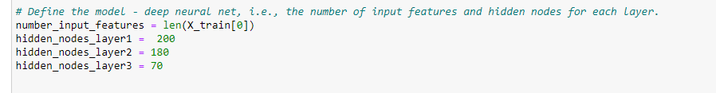
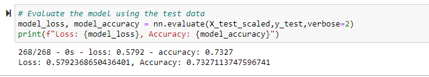
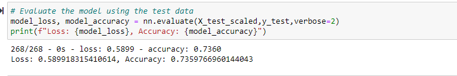
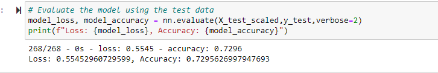

# Neural_Network_Charity_Analysis

## Overview 
The purpose of this analysis is to help a company called Alphabet Soup Foundation create a way to determine if companies they invest in will be successful. Using machine learning and neural networks, a binary classifier was created in determining success rate based on many of each companies factors. 

## Results 
### Data Preprocessing
1.) What variable(s) are considered the target(s) for your model?
- The predicted outcome is our target (IS_SUCCESSFUL column).

2.) What variable(s) are considered to be the features for your model?
- All of the variables used to make a prediction are the features which are: APPLICATION_TYPE, AFFILIATION, CLASSIFICATION, USE_CASE, ORGANIZATION, STATUS, INCOME_AMT, SPECIAL_CONSIDERATIONS, ASK_AMT

3.) What variable(s) are neither targets nor features, and should be removed from the input data?
- The EIN and NAME are identifiers not variables and have been removed. 

### Compiling, Training, and Evaluating the Model 
- For my first optimization i greatly increases the depth of the layers and added a third overal layer. 

Optimizer1 Results:

- For my second optimization I increased the amount of bins by changing the type_count and class_count and kept the larger neural network. 

Optimizer2 Results:

- For my last optimization, I returned to the original neural network and changed the "relu" activation function to "tanh"

Optimizer3 Results:

